# Introduction à la concurrence, au parallélisme et à l'asynchronisme

Dans le développement d'applications modernes, il est souvent nécessaire
d'exécuter plusieurs tâches simultanément pour améliorer les performances et la
réactivité. Python offre plusieurs approches pour gérer l'exécution simultanée
de code.

Nous allons voir dans les prochaines sections trois paquets principaux pour
gérer la concurrence et le parallélisme en Python :

- `threading` : pour la gestion des threads
- `multiprocessing` : pour la gestion des processus
- `asyncio` : pour la programmation asynchrone

Avant d'aller plus loin, il est important de comprendre quelques concepts clés.

## Concurrence vs Parallélisme

Il est important de distinguer ces deux concepts fondamentaux :

### Concurrence

La **concurrence** consiste à gérer plusieurs tâches en même temps, mais pas
nécessairement simultanément. Les tâches peuvent être entrelacées (interleaved)
sur un seul processeur. C'est comme un jongleur qui lance plusieurs balles : il
ne manipule qu'une balle à la fois, mais donne l'illusion de les gérer toutes
simultanément.

```mermaid
gantt
    title Concurrence - Tâches entrelacées sur un seul processeur
    dateFormat X
    axisFormat %s
    
    section CPU 1
    Tâche A    :a1, 0, 1
    Tâche A    :a2, 3, 4
    Tâche B    :b1, 1, 2
    Tâche B    :b2, 4, 5
    Tâche C    :c1, 2, 3
    Tâche C    :c2, 5, 6
```

### Parallélisme

Le **parallélisme** implique l'exécution réellement simultanée de plusieurs
tâches sur plusieurs processeurs ou cœurs. C'est comme avoir plusieurs
jongleurs, chacun manipulant ses propres balles en même temps.

```mermaid
gantt
    title Parallélisme - Tâches simultanées sur plusieurs processeurs
    dateFormat X
    axisFormat %s
    
    section CPU 1
    Tâche A    :a1, 0, 1
    Tâche A    :a2, 3, 4
    Tâche B    :b1, 1, 2
    Tâche B    :b2, 4, 5
    Tâche C    :c1, 2, 3
    Tâche C    :c2, 5, 6
    
    section CPU 2
    Tâche D    :b1, 0, 6
    
    section CPU 3
    Tâche E    :c1, 0, 3
    Tâche F    :c2, 3, 6
```

## Threads vs Processus vs Asynchrone

Python propose trois mécanismes principaux pour l'exécution simultanée :

### Threads (Fils d'exécution)

- **Définition** : Unités d'exécution légères qui partagent le même espace mémoire
- **Avantages** : Création rapide, faible consommation mémoire, partage facile de données
- **Inconvénients** : Problèmes de synchronisation, race conditions possibles

Les threads sont particulièrement adaptés aux tâches I/O-intensives et on
l'avantage de partager le même espace mémoire, ce qui facilite la communication
entre eux. Bien que les systèmes d'exploitation modernes permettent l'exécution
en parallèle de plusieurs threads, le Global Interpreter Lock (GIL, voir plus
bas) limite leur efficacité en Python pour les tâches CPU-intensives.

### Processus

- **Définition** : Unités d'exécution indépendantes avec leur propre espace mémoire
- **Avantages** : Isolation complète, vrai parallélisme, robustesse
- **Inconvénients** : Création plus coûteuse, communication inter-processus complexe

Les processus sont idéaux pour les tâches CPU-intensives, car ils peuvent
s'exécuter en parallèle sur plusieurs cœurs. C'est aussi une solution robuste, car
chaque processus est isolé des autres, ce qui réduit les risques de corruption de données.
Par contre la communication entre processus est plus complexe.

### Programmation Asynchrone

- **Définition** : Modèle de concurrence basé sur des événements et des coroutines
- **Avantages** : Économie de ressources, pas de problèmes de synchronisation
- **Inconvénients** : Courbe d'apprentissage, gestion des erreurs plus complexe

Une solution plus moderne aux problèmes de concurrence est la programmation
asynchrone, qui utilise des coroutines pour gérer les tâches de manière non
bloquante. Elle est très utilisée dans la programmation web.

## Le GIL (Global Interpreter Lock)

Le **GIL** est une limitation spécifique à CPython qui empêche l'exécution
simultanée de bytecode Python par plusieurs threads :

- **Impact** : Les threads Python ne peuvent pas exploiter pleinement le
  parallélisme sur les tâches CPU-intensives
- **Exceptions** : Les opérations I/O (lecture/écriture de fichiers, requêtes
  réseau) libèrent le GIL
- **Conséquence** : Pour le vrai parallélisme CPU, il faut utiliser des
  processus ou des paquets écrits en C/C++ qui libèrent le GIL comme par
  exemple [NumPy](https://numpy.org/) ou [Pandas](https://pandas.pydata.org/).

Chaque processus Python possède son propre GIL, ce qui permet l'exécution
simultanée de plusieurs processus sur plusieurs cœurs.

## Références

Il existe de nombreux tutoriels et ressources en ligne pour approfondir vos connaissances sur la concurrence en Python :

### Threading

- [Documentation officielle de Python sur le multithreading](https://docs.python.org/3/library/threading.html)
- [Geeks for Geeks](https://www.geeksforgeeks.org/python/multithreading-python-set-1/)
- [Real Python](https://realpython.com/intro-to-python-threading/)

### Multiprocessing

- [Documentation officielle de Python sur le multiprocessing](https://docs.python.org/3/library/multiprocessing.html)
- [Geeks for Geeks](https://www.geeksforgeeks.org/multiprocessing-python-set-1/)
- [Real Python](https://realpython.com/python-concurrency/)

### Programmation Asynchrone

- [Documentation officielle de Python sur l'asynchrone](https://docs.python.org/3/library/asyncio.html)
- [Geeks for Geeks](https://www.geeksforgeeks.org/python/asyncio-in-python/)
- [Real Python](https://realpython.com/async-io-python/)
