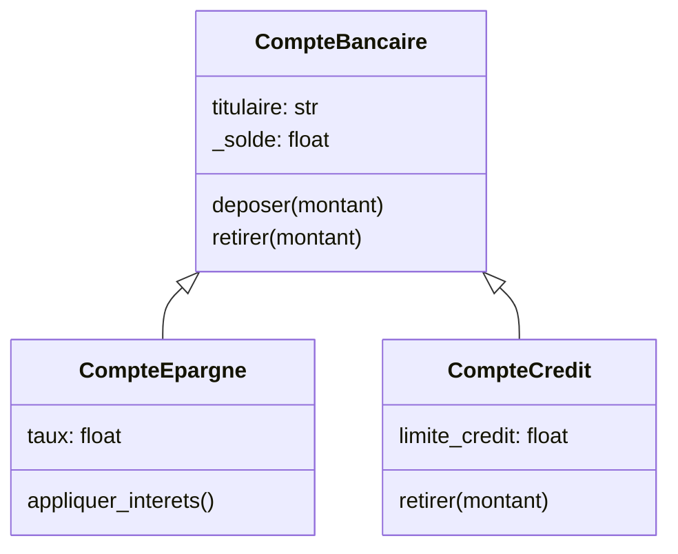
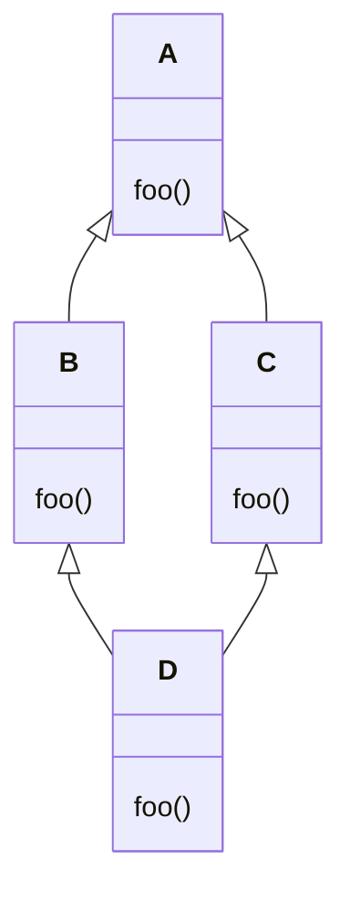

# Pilier 2 — Héritage

L'**héritage** est le deuxième pilier de la POO. Il permet à une classe (la
*classe fille* ou *dérivée*) de **réutiliser** les attributs et méthodes d'une
autre classe (la *classe mère* ou *de base*), sans les réécrire.

L'héritage modélise une relation **« est-un »** : un `CompteEpargne` *est un*
`CompteBancaire`. Il permet de créer des hiérarchies de classes de plus en plus
spécialisées, tout en évitant la duplication de code (principe *DRY — Don't
Repeat Yourself*).

## Héritage simple

En Python, on hérite d'une classe en la plaçant entre parenthèses après le nom
de la classe fille :

```python
class CompteBancaire:
    def __init__(self, titulaire, solde=0.0):
        self.titulaire = titulaire
        self._solde = solde

    def deposer(self, montant):
        self._solde += montant

    def retirer(self, montant):
        if montant > self._solde:
            raise ValueError("Fonds insuffisants.")
        self._solde -= montant

    def __str__(self):
        return f"Compte({self.titulaire}, {self._solde:.2f} $)"


class CompteEpargne(CompteBancaire):        # hérite de CompteBancaire
    def __init__(self, titulaire, solde=0.0, taux=0.02):
        super().__init__(titulaire, solde)  # initialise la partie CompteBancaire
        self.taux = taux

    def appliquer_interets(self):
        self._solde += self._solde * self.taux


class CompteCredit(CompteBancaire):         # hérite de CompteBancaire
    def __init__(self, titulaire, limite_credit=1000.0):
        super().__init__(titulaire, 0.0)
        self.limite_credit = limite_credit

    def retirer(self, montant):             # redéfinition — le découvert est autorisé
        if montant > self._solde + self.limite_credit:
            raise ValueError("Limite de crédit dépassée.")
        self._solde -= montant
```

<div style={{"text-align": "center"}}>



</div>

```python
epargne = CompteEpargne("Alice", 1000, taux=0.05)
epargne.deposer(500)           # méthode héritée de CompteBancaire
epargne.appliquer_interets()   # méthode propre à CompteEpargne
print(epargne)                 # Compte(Alice, 1575.00 $)

credit = CompteCredit("Bob", limite_credit=500)
credit.retirer(300)            # redéfinition — découvert autorisé
print(credit)                  # Compte(Bob, -300.00 $)
```

## La méthode `super()`

`super()` retourne un proxy vers la **classe suivante dans le MRO** (l'ordre de
résolution des méthodes). Elle est le moyen recommandé d'appeler une méthode de
la classe mère depuis une classe fille.

Son usage le plus courant est dans `__init__` pour initialiser la partie héritée
avant d'ajouter les attributs spécifiques à la classe fille :

```python
class CompteEpargne(CompteBancaire):
    def __init__(self, titulaire, solde=0.0, taux=0.02):
        super().__init__(titulaire, solde)  # ← délègue à CompteBancaire.__init__
        self.taux = taux                   # ← attribut propre à CompteEpargne
```

On pourrait appeler `CompteBancaire.__init__(self, titulaire, solde)` directement,
mais `super()` est préférable car elle **s'adapte automatiquement** à la
hiérarchie, notamment en cas d'héritage multiple.

`super()` s'utilise aussi pour **étendre** une méthode plutôt que la remplacer :

```python
class CompteEpargne(CompteBancaire):
    def retirer(self, montant):
        print(f"Retrait depuis un compte épargne : frais de 0.50 $")
        super().retirer(montant + 0.50)   # appelle la logique de la classe mère
```

## Héritage multiple

En Python, une classe peut hériter de **plusieurs classes mères** simultanément.

```python
class Notifiable:
    def notifier(self, message):
        print(f"[Notification] {message}")

class CompteEpargneNotifiable(CompteEpargne, Notifiable):
    def appliquer_interets(self):
        super().appliquer_interets()
        self.notifier(f"Intérêts appliqués. Nouveau solde : {self._solde:.2f} $")

c = CompteEpargneNotifiable("Alice", 1000, taux=0.05)
c.appliquer_interets()
# [Notification] Intérêts appliqués. Nouveau solde : 1050.00 $
```

L'héritage multiple doit être utilisé avec **parcimonie** : il peut rendre le
code difficile à comprendre et à maintenir. Préférez la [composition](./composition_heritage)
lorsque possible.

### Le problème du diamant

Un problème classique de l'héritage multiple survient quand deux classes mères
héritent elles-mêmes d'une même classe :

<div style={{"text-align": "center"}}>



</div>

Quand `D.foo()` est appelé, quelle version utiliser — celle de `B` ou de `C` ?
Python résout cette ambiguïté avec le **MRO**.

## Ordre de résolution des méthodes (MRO)

Le **MRO** (*Method Resolution Order*) est l'ordre dans lequel Python parcourt
les classes pour trouver une méthode. Il est calculé avec l'algorithme **C3**,
qui garantit un ordre cohérent et sans ambiguïté.

On peut consulter le MRO d'une classe avec `.__mro__` :

```python
class A:
    def foo(self): print("A")

class B(A):
    def foo(self): print("B")

class C(A):
    def foo(self): print("C")

class D(B, C):
    pass

print(D.__mro__)
# (<class 'D'>, <class 'B'>, <class 'C'>, <class 'A'>, <class 'object'>)

D().foo()  # "B" — Python prend la première définition dans le MRO
```

Le MRO garantit que :
1. La classe elle-même est toujours cherchée en premier.
2. L'ordre des classes mères déclaré est respecté.
3. Chaque classe n'apparaît qu'une seule fois.

## Héritage coopératif

Lorsque plusieurs classes d'une hiérarchie multiple définissent `__init__`,
l'**héritage coopératif** garantit que chaque classe est initialisée **une seule
fois** et dans le bon ordre, en s'appuyant sur le MRO et `super()`.

Principe : chaque classe traite ses propres paramètres, puis transmet le reste
via `**kwargs` à `super().__init__()`.

```python
class Notifiable:
    def __init__(self, email, **kwargs):
        self.email = email
        super().__init__(**kwargs)   # transmet les kwargs restants

    def notifier(self, message):
        print(f"[{self.email}] {message}")

class CompteBancaire:
    def __init__(self, titulaire, solde=0.0, **kwargs):
        self.titulaire = titulaire
        self._solde = solde
        super().__init__(**kwargs)

class CompteEpargneNotifiable(Notifiable, CompteBancaire):
    def __init__(self, titulaire, solde, taux, email):
        super().__init__(titulaire=titulaire, solde=solde, email=email)
        self.taux = taux

c = CompteEpargneNotifiable("Alice", 1000, taux=0.05, email="alice@exemple.com")
print(c.titulaire)  # Alice
print(c.email)      # alice@exemple.com
c.notifier("Bienvenue !")
```

Sans héritage coopératif, certaines classes dans la chaîne pourraient être
initialisées deux fois ou pas du tout dans un scénario en diamant.
