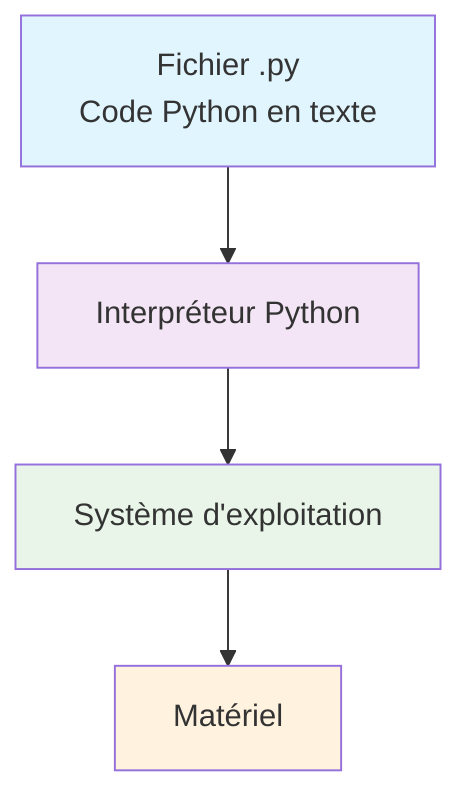
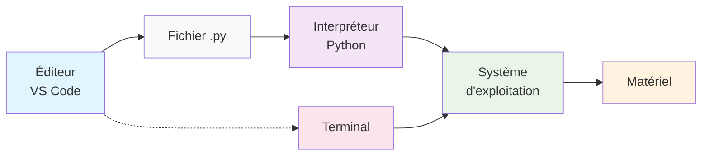

# Python, terminal, OS et éditeurs de texte

Comprendre l'environnement de développement Python nécessite de saisir comment
différentes couches technologiques interagissent. Cette page explique ces
couches et leur rôle dans le développement Python.

## Les quatre couches technologiques

### 1. Le matériel (hardware)

**La base physique de tout système informatique :**

* **Processeur (CPU)** : exécute les instructions machine
* **Mémoire (RAM)** : stocke temporairement les données et programmes en cours d'exécution
* **Stockage** : disques durs, SSD qui conservent les fichiers de façon permanente
* **Périphériques** : clavier, souris, écran, réseau, etc.

Le matériel ne comprend que le **langage machine** (binaire : 0 et 1). Toutes
les couches supérieures sont des abstractions qui facilitent l'interaction avec
ce matériel.

### 2. Le système d'exploitation (OS)

**L'intermédiaire entre le matériel et les programmes :**

Le système d'exploitation (Windows, macOS, Linux) a plusieurs rôles cruciaux :

* **Gestion du matériel** : contrôle l'accès au processeur, à la mémoire, aux
  périphériques
* **Gestion des fichiers** : organise le stockage en dossiers et fichiers
* **Gestion des processus** : lance, arrête et supervise les programmes
* **Interface utilisateur** : fournit un terminal (ligne de commande) et/ou une
  interface graphique

:::info 

Le **terminal** (ou invite de commandes) est une interface textuelle qui permet
d'interagir directement avec le système d'exploitation. C'est un outil puissant
pour notamment :

- Naviguer dans les dossiers
- Lancer des programmes
- Gérer les fichiers
- Configurer l'environnement de développement

:::

### 3. Python : l'interpréteur

**Un programme qui lit et exécute du code Python :**

Python est lui-même un **programme** installé sur votre système d'exploitation. Son rôle :

* **Lire les fichiers texte** contenant du code Python (`.py`)
* **Analyser et interpréter** ce code ligne par ligne
* **Traduire** les instructions Python en langage machine
* **Exécuter** ces instructions via le système d'exploitation

**Exemple :** Quand vous écrivez `print("Hello")`, l'interpréteur Python :
1. Lit cette ligne dans votre fichier `.py`
2. La traduit en instructions pour afficher du texte
3. Demande au système d'exploitation d'afficher ce texte à l'écran

### 4. Les éditeurs de texte et IDE

**Les outils qui facilitent l'écriture et la gestion du code :**

Les éditeurs et environnements de développement intégrés (IDE) comme **VS
Code** ou **PyCharm** nous aident à :

#### Écriture de code

* **Coloration syntaxique** : met en évidence les mots-clés Python
* **Auto-complétion** : suggère le code pendant la frappe
* **Détection d'erreurs** : souligne les erreurs de syntaxe

#### Gestion de projets

* **Explorateur de fichiers** : navigation dans l'arborescence du projet
* **Terminal intégré** : accès direct à la ligne de commande
* **Gestionnaire d'extensions** : ajout de fonctionnalités

#### Outils de développement

* **Débogueur** : permet de traquer les erreurs pas à pas
* **Gestionnaire d'environnements virtuels** : isolation des dépendances
* **Intégration Git** : gestion des versions du code

:::tip

Les éditeurs modernes facilitent la gestion des **environnements virtuels**
(voir [les projets Python](./projet_python.mdx)). Ces environnements isolent
les dépendances de chaque projet, évitant les conflits entre différentes
versions de bibliothèques.

:::

## Interaction entre les couches

Voici comment ces couches collaborent quand vous développez en Python :

**Exemple concret :**

1. **Dans l'éditeur** : vous tapez `x = 5 + 3`
2. **Sauvegarde** : l'éditeur écrit ce texte dans un fichier `.py` sur le disque
3. **Exécution** : via le terminal, vous lancez `python mon_script.py`
4. **Interprétation** : Python lit le fichier, et sait qu'il doit calculer `5 + 3` et stocker le résultat dans `x`
5. **Système** : le système d'exploitation gère la mémoire pour stocker cette variable
6. **Matériel** : le processeur effectue l'addition, la RAM stocke le résultat
