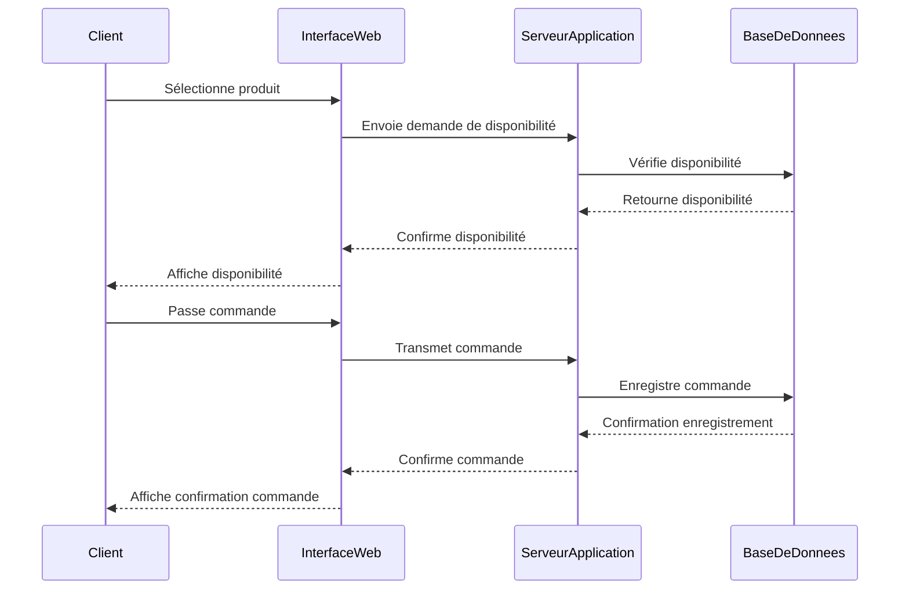

# Diagramme de séquence

Le diagramme de séquence intervient principalement lors de la conception
détaillée d'un système logiciel. Il permet de visualiser précisément comment
les différents objets ou composants d'un système interagissent entre eux au fil
du temps à travers l'échange de messages. Un message peut correspondre à une
demande, une réponse, un signal ou encore une commande envoyée entre les objets
ou acteurs du système. Ce type de diagramme est particulièrement utile pour
clarifier les comportements dynamiques du système et s'assurer que tous les
scénarios possibles sont pris en compte.

## Quand utilise-t-on le diagramme de séquence ?

Le diagramme de séquence est utilisé dans les cas suivants :

- Durant la phase de conception technique d'un logiciel, après la définition
claire des besoins fonctionnels.

- Pour analyser et spécifier des scénarios précis d'interaction.

- Lorsqu'il faut communiquer des détails techniques à l'équipe de
  développement, particulièrement aux développeurs et aux architectes
  logiciels.

## À qui s'adresse-t-il ?

Le diagramme de séquence s'adresse principalement aux développeurs, pour
implémenter correctement les interactions définies ainsi qu'aux architectes
logiciels, pour valider la cohérence technique des scénarios.


## Étapes pour créer un diagramme de séquence

1. Identifier les acteurs.
2. Déterminer les interactions : Identifier l'ordre chronologique des messages
   échangés entre les acteurs et les objets. Utiliser des verbes d'action pour
    nommer les messages.
3. Tracer le diagramme : Utiliser des lignes verticales pour chaque participant
   et des flèches pour représenter les échanges de messages, avec des
   annotations détaillées.
4. Valider le scénario : Vérifier que le scénario décrit est complet, cohérent
   et représentatif des interactions attendues.

## Exemple détaillé en MermaidJS

Voici un exemple concret de diagramme de séquence illustrant le processus d'une
commande en ligne:

<Tabs>
  <TabItem value="mermaid" label="Diagramme">

</TabItem>
<TabItem value="code" label="Code">
````markdown

````
</TabItem>
</Tabs>