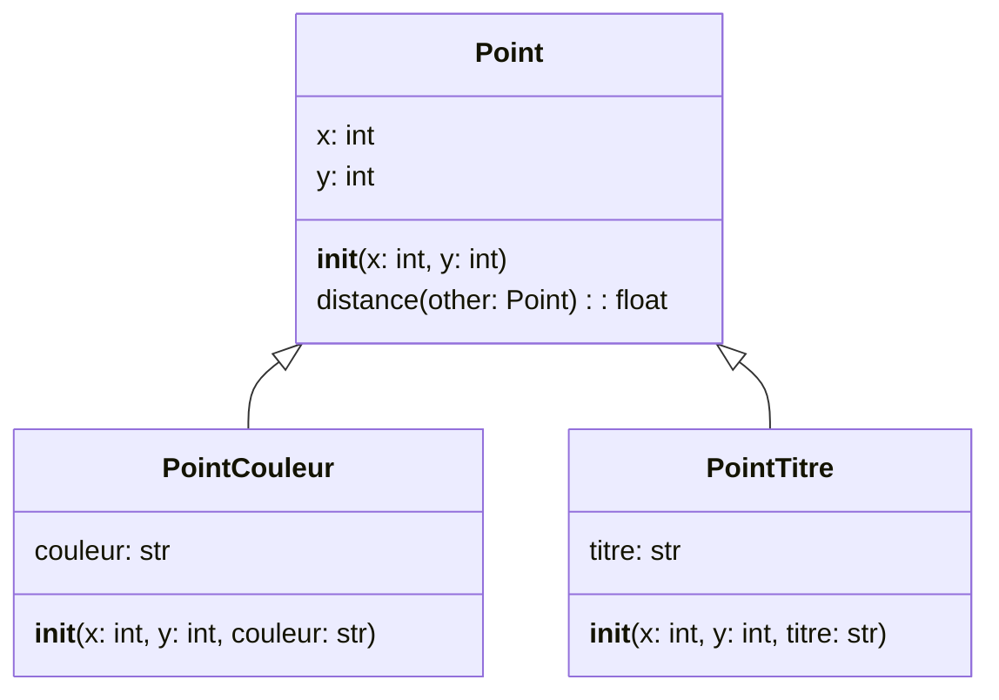

# Héritage

L'héritage est un concept fondamental en programmation orientée objet. Il permet
de définir une classe en se basant sur une autre classe déjà existante. La
classe existante est appelée la classe mère ou la classe de base, et la nouvelle
classe est appelée la classe fille ou la classe dérivée. Cela permet de
réutiliser le code déjà existant et de créer des classes plus spécialisées.

Par exemple, la classe `Point` définie précédemment peut être utilisée comme
classe de base pour définir une classe `PointCouleur` qui ajoute un attribut
`couleur` à un point. On pourrait aussi définir une classe `PointTitre` qui
ajoute un attribut `titre` à un point. Ces deux classes héritent des attributs
et des méthodes de la classe `Point`.

<center>



</center>

Le code Python correspondant serait le suivant :

```python
class Point:
    def __init__(self, x, y):
        self.x = x
        self.y = y

    def distance(self, other):
        return ((self.x - other.x) ** 2 + (self.y - other.y) ** 2) ** 0.5

class PointCouleur(Point):
    def __init__(self, x, y, couleur):
        super().__init__(x, y)
        self.couleur = couleur

class PointTitre(Point):
    def __init__(self, x, y, titre):
        super().__init__(x, y)
        self.titre = titre
```

Dans cet exemple, la classe `PointCouleur` hérite de la classe `Point` en
spécifiant `Point` entre parenthèses après le nom de la classe. Cela signifie
que `PointCouleur` hérite de tous les attributs et méthodes de la classe `Point`.
La méthode `__init__` de la classe `PointCouleur` appelle la méthode `__init__`
de la classe `Point` en utilisant la fonction `super()`. Cela permet d'initialiser
les attributs de la classe `Point` avant d'ajouter l'attribut `couleur`.

Ainsi, l'héritage permet de créer une hiérarchie de classes où les classes
filles héritent des attributs et des méthodes des classes mères.

## La méthode `super()`

La fonction `super()` est utilisée pour appeler un attribut ou une méthode de
la classe mère depuis une classe fille. Elle est souvent utilisée dans les
méthodes `__init__` pour initialiser les attributs de la classe mère avant
d'ajouter des attributs spécifiques à la classe fille comme dans l'exemple
précédent.

Il serait également possible d'appeler directement la méthode de la classe mère
comme suit :

```python
class PointCouleur(Point):
    def __init__(self, x, y, couleur):
        Point.__init__(self, x, y)
        self.couleur = couleur
```

Toutefois, l'utilisation de `super()` est recommandée car elle permet de gérer
automatiquement la hiérarchie des classes. De plus, la méthode `super()` est
particulièrement utile également pour étendre une méthode de la classe mère
dans une classe fille plutôt que de la remplacer complètement. Nous verrons
ceci à la section [polymorphisme](./polymorphisme.md).
ceci à la section [polymorphisme](./polymorphisme.md).
