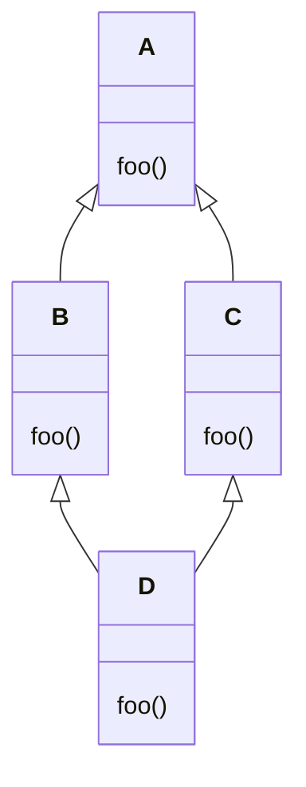

# Héritage multiple

En Python, une classe peut hériter de plusieurs classes mères. C'est ce qu'on
appelle l'héritage multiple. Par exemple, si on avait une classe `Parler` et
une classe `Marcher`, on pourrait définir une classe `Personne` qui hérite à
la fois de `Parler` et de `Marcher` :

```python
class Parler:
    def parler(self):
        print("Je parle !")

class Marcher:
    def marcher(self):
        print("Je marche !")

class Personne(Parler, Marcher):
    pass

p = Personne()
p.parler()   # Affiche : Je parle !
p.marcher()  # Affiche : Je marche !
```

Dans cet exemple, la classe `Personne` hérite à la fois des méthodes `parler` de
la classe `Parler` et `marcher` de la classe `Marcher`. Puisque `Personne` n'a
rien de spécifique, on utilise le mot-clé `pass` pour indiquer que la classe ne
contient pas de code supplémentaire.

Voici le même exemple avec des paramètres pour les constructeurs :

```python
class Parler:
    def __init__(self, message):
        self.message = message

    def parler(self):
        print(self.message)

class Marcher:
    def __init__(self, distance):
        self.distance = distance

    def marcher(self):
        print(f"Je marche sur {self.distance} mètres.")

class Personne(Parler, Marcher):
    def __init__(self, message, distance):
        Parler.__init__(self, message)
        Marcher.__init__(self, distance)

p = Personne("Bonjour !", 10)
p.parler()   # Affiche : Bonjour !
p.marcher()  # Affiche : Je marche sur 10 mètres.
```

Dans le constructeur de la classe `Personne`, on appelle les constructeurs des
classes mères `Parler` et `Marcher` pour initialiser les attributs `message` et
`distance`. Il existe également une autre façon d'appeler les constructeurs des
classes mères en utilisant la fonction `super()`. Ceci sera abordé dans la
section suivante.

## Héritage coopératif

L'exemple précédent illustre l'héritage multiple en Python. Cependant, l'héritage
multiple peut être source de complexité et de conflits si les classes mères
définissent des méthodes ou des attributs avec le même nom. Il peut aussi être un
casse-tête lorsque les classes mères elles-mêmes héritent d'une même classe mère,
soit un héritage en diamant.

<center>



</center>

Pour éviter ces problèmes, je vous recommande de privilégier l'héritage simple ou
de recourir à l'héritage multiple avec parcimonie. Si vous voulez vraiment utiliser
l'héritage multiple, vous pouvez utiliser l'héritage coopératif.

L’héritage coopératif est une approche de l’héritage multiple en Python qui
permet à chaque classe d’une hiérarchie d’appeler `super` de manière à ce
que toutes les classes soient correctement initialisées, sans doublons ni oubli.
Cela repose sur l’ordre de résolution des méthodes de Python (MRO, Method
Resolution Order).

Principe de l’héritage coopératif

- **Chaîne d’initialisation** : Chaque classe, dans sa méthode `__init__`,
réalise ses propres initialisations (comme l’affectation d’attributs
spécifiques) **avant** d’appeler `super`. Cela permet de s’assurer que l’état
local de la classe est prêt avant de déléguer l’appel au constructeur de la
classe suivante dans la chaîne.

- **Passage des paramètres** : Pour que chaque classe puisse traiter les
paramètres qui lui sont propres, on transmet les arguments non utilisés à l’aide
de `**kwargs`. Chaque classe extrait les paramètres dont elle a besoin, puis
transmet le reste en appelant `super().__init__(**kwargs)`.

L'exemple précédent peut être réécrit en utilisant l'héritage coopératif :

```python
class Parler:
    def __init__(self, message, **kwargs):
        self.message = message
        super().__init__(**kwargs)

    def parler(self):
        print(self.message)

class Marcher:
    def __init__(self, distance, **kwargs):
        self.distance = distance
        super().__init__(**kwargs)

    def marcher(self):
        print(f"Je marche sur {self.distance} mètres.")

class Personne(Parler, Marcher):
    def __init__(self, message, distance):
        super().__init__(message=message, distance=distance)

p = Personne("Bonjour !", 10)
p.parler()   # Affiche : Bonjour !
p.marcher()  # Affiche : Je marche sur 10 mètres.
```

Dans cet exemple, les classes `Parler` et `Marcher` appellent `super().__init__(**kwargs)`
dans leur constructeur respectif pour transmettre les arguments non utilisés à
la classe suivante dans la chaîne d'héritage. Cela permet de garantir que chaque
classe est correctement initialisée sans doublons ni oubli.

## Ordre de résolution des méthodes (MRO)

Le MRO est un mécanisme central dans Python qui détermine dans quel ordre les
classes sont parcourues lors de la recherche d'une méthode ou d'un attribut,
notamment dans les cas d'héritage multiple.

En effet, lorsqu'une méthode est appelée sur un objet, Python doit savoir dans quelle
classe chercher cette méthode. Dans une hiérarchie simple (héritage
simple), c'est évident : on cherche d'abord dans la classe de l'objet, puis dans
sa classe parente, etc. Mais avec l'héritage multiple, où une classe peut
hériter de plusieurs classes mères, il faut un ordre précis et cohérent pour
éviter les ambiguïtés. Le MRO définit donc cet ordre de recherche.

En Python, le MRO est calculé en utilisant l'algorithme C3, qui garantit que
l'ordre de résolution est cohérent et sans ambiguïté. Cet algorithme prend en
compte l'ordre dans lequel les classes sont définies, ainsi que les dépendances
entre les classes. Bien que l'algorithme C3 soit complexe, il est rare que vous
ayez besoin de vous en soucier, car Python gère automatiquement le MRO pour vous.

En réalité, lorsque vous appelez la méthode `super()`, Python utilise le MRO pour
déterminer quelle classe appeler.