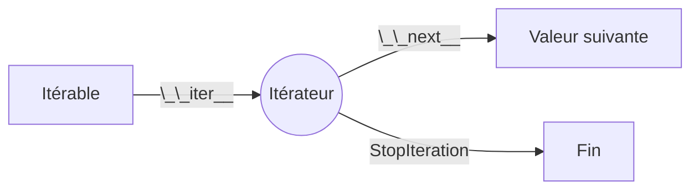

# Itérateurs et générateurs

Les *itérateurs* sont au cœur de la « philosophie » Python. Dès que vous
écrivez une boucle `for`, que vous parcourez un fichier, que vous utilisez une
*compréhension de liste*, ou encore que vous appliquez `sum()` sur une
séquence, vous exploitez le **protocole d'itération**.

Dans cette section, nous allons :

1. Distinguer *itérable* et *itérateur*.
2. Comprendre le protocole (`__iter__()` et `__next__()`).
3. Reproduire le fonctionnement interne d'une boucle `for`.
4. Créer nos propres itérateurs (classe) et voir les pièges fréquents.
5. Introduire les générateurs (fonctions avec `yield`).
6. Voir les expressions génératrices (*generator expressions*).
7. Étudier `yield from` pour déléguer l'itération.
8. Discuter avantages / limites (mémoire, paresse, épuisement, pas de *reset*).
9. Survoler quelques outils utiles (`iter()`, `next()`, `itertools`).

---

## 1. Itérable vs itérateur

Ces deux mots se ressemblent, mais ne sont pas synonymes :

| Terme        | Définition courte | Méthode clé | Exemple typique |
|--------------|-------------------|-------------|-----------------|
| Itérable     | Objet capable de fournir un itérateur | `__iter__()` | `list`, `str`, `dict`, `range`, fichier |
| Itérateur    | Objet qui produit des valeurs, une à la fois | `__next__()` & `__iter__()` | Objet renvoyé par `iter(list)` |

Un **itérable** implémente au minimum la méthode spéciale `__iter__()` qui
retourne un **itérateur**. Un **itérateur** implémente `__next__()` qui renvoie
la *prochaine* valeur ou soulève l'exception `StopIteration` quand il n'y en a
plus.

```python
texte = "ABC"              # C'est un itérable
it = iter(texte)           # Appelle texte.__iter__() => itérateur
print(next(it))  # 'A'
print(next(it))  # 'B'
print(next(it))  # 'C'
print(next(it))  # StopIteration (exception)
```

Remarquez qu'un même itérable peut produire *plusieurs* itérateurs distincts :

```python
nums = [10, 20, 30]
it1 = iter(nums)
it2 = iter(nums)
print(next(it1))  # 10
print(next(it2))  # 10 (it2 est indépendant de it1)
```

Un **itérateur** est aussi *iterable* (il a `__iter__` qui retourne `self`) mais
il ne redémarre pas : une fois épuisé, il l'est pour de bon.

### Visualisation simplifiée



---

## 2. Le protocole d'itération

Le « protocole » est juste un petit contrat informel :

1. `obj.__iter__()` retourne un objet qui a `__next__()`.
2. `it.__next__()` renvoie la valeur suivante ou soulève `StopIteration`.

Python fournit deux fonctions natives qui utilisent ce protocole :

- `iter(obj)` appelle `obj.__iter__()` ;
- `next(it, valeur_par_defaut)` appelle `it.__next__()`.

```python
class Compteur:
	def __init__(self, debut: int, fin: int):
		self.debut = debut
		self.fin = fin

	def __iter__(self):
		# Retourne un VRAI itérateur (objet séparé)
		return CompteurIter(self.debut, self.fin)

class CompteurIter:
	def __init__(self, courant: int, fin: int):
		self.courant = courant
		self.fin = fin

	def __iter__(self):  # Un itérateur retourne lui-même
		return self

	def __next__(self):
		if self.courant > self.fin:
			raise StopIteration
		valeur = self.courant
		self.courant += 1
		return valeur

for n in Compteur(3, 5):
	print(n)   # 3 4 5
```

### Variante minimaliste (itérateur et itérable fusionnés)

```python
class CompteurSimple:
	def __init__(self, debut, fin):
		self.courant = debut
		self.fin = fin

	def __iter__(self):
		return self  # L'objet est son propre itérateur (NON réutilisable)

	def __next__(self):
		if self.courant > self.fin:
			raise StopIteration
		val = self.courant
		self.courant += 1
		return val

it = CompteurSimple(1, 3)
list(it)    # [1, 2, 3]
list(it)    # [] car déjà épuisé
```

---

## 3. Ce que fait réellement une boucle `for`

Une boucle `for x in objet:` est grosso modo équivalente à :

```python
it = iter(objet)
while True:
	try:
		x = next(it)
	except StopIteration:
		break
	# corps de la boucle utilisant x
```

Savoir cela vous aide à comprendre pourquoi certaines structures (p.ex. `for`
sur un fichier ouvert) ne *repartent* pas au début automatiquement.

---

## 4. `StopIteration`

L'exception `StopIteration` n'est presque jamais attrapée *manuellement* dans
vos programmes (sauf cas pédagogiques). Elle sert surtout de signal interne
pour indiquer « il n'y a plus de données ».

Évitez d'écrire :

```python
try:
	while True:
		print(next(it))
except StopIteration:
	pass
```

Préférez simplement `for x in it:`.

---

## 5. Générateurs : `yield`

Une **fonction génératrice** est une fonction qui contient le mot clé `yield`.
Quand on l'appelle, elle ne s'exécute pas entièrement : elle retourne un
itérateur spécial (un *generator object*). Chaque `yield` produit une valeur et
gèle l'état local jusqu'à la prochaine demande (`next()`).

```python
def pairs(max_inclus: int):
	n = 0
	while n <= max_inclus:
		if n % 2 == 0:
			yield n  # pause ici
		n += 1

for p in pairs(10):
	print(p)   # 0 2 4 6 8 10
```

Différences clés entre `yield` et `return` :

- `return valeur` termine la fonction définitivement.
- `yield valeur` retourne *temporairement* une valeur et reprendra ensuite.
- Un `return` (sans valeur) dans un générateur équivaut à lever `StopIteration`.

### Exemple : Fibonacci paresseux

```python
def fibonacci():
	a, b = 0, 1
	while True:        # Générateur infini !
		yield a
		a, b = b, a + b

fib = fibonacci()
print(next(fib))  # 0
print(next(fib))  # 1
print(next(fib))  # 1
print(next(fib))  # 2
```

:::warning
Un générateur *peut être infini*. Utilisez avec prudence des opérations qui
consomment « tout » (ex: `list(fibonacci())` gèlera votre programme) !
:::

---

## 6. Expressions génératrices (generator expressions)

Syntaxe compacte similaire aux *list comprehensions*, mais paresseuse.

| Structure              | Évalue tout immédiatement ? | Exemple |
|------------------------|-----------------------------|---------|
| List comprehension     | Oui (en mémoire)            | `[x*x for x in range(5)]` |
| Generator expression   | Non (à la demande)          | `(x*x for x in range(5))` |

```python
carrés = (n * n for n in range(1_000_000))
print(next(carrés))  # 1
print(next(carrés))  # 4
# La mémoire reste minime même pour « 1_000_000 »
```

Vous pouvez chaîner :

```python
import math
racines_paires = (math.sqrt(x) for x in range(1000) if x % 2 == 0)
for r in racines_paires:
	pass  # Traitement
```

---

## 7. `yield from`

Permet de déléguer l'itération à un autre itérateur/générateur.

```python
def sous_bloc():
	yield 1
	yield 2

def bloc():
	yield 0
	yield from sous_bloc()   # délégation
	yield 3

list(bloc())  # [0, 1, 2, 3]
```

Avantages : code plus lisible, propagation correcte de `StopIteration`.

---

## 8. Avantages des itérateurs / générateurs

1. Mémoire : aucune liste géante construite si ce n'est pas nécessaire.
2. Paresse (*lazy*) : on calcule uniquement ce qui est demandé.
3. Flux potentiellement infinis (lecture de capteurs, streams, sockets...).
4. Composition : on peut enchaîner des filtres sans matérieliser chaque étape.
5. Clarté : un générateur remplace souvent une classe itératrice verbeuse.

### Exemple mémoire

Comparer deux approches pour sommer les carrés de 0 à 9_999_999 :

```python
# VERSION Non paresseuse (consomme beaucoup de RAM)
total = sum([n*n for n in range(10_000_000)])

# VERSION paresseuse
total_lazy = sum(n*n for n in range(10_000_000))
```

La deuxième n'alloue jamais la grande liste intermédiaire.

---

## 9. Contraintes / limites importantes

1. Un itérateur est **épuisable** : après l'avoir parcouru, il est vide.
2. Pas de *reset* automatique : il faut recréer l'itérateur.
3. Débogage moins trivial (on ne « voit » pas tout en mémoire).
4. Parfois on *veut* matérialiser (besoin de longueur, d'accès aléatoire, etc.).

### Réinitialiser ?

Ne pas chercher une méthode magique `reset()`. À la place, structurez votre
code avec une classe qui retourne un **nouvel** itérateur à chaque `__iter__()` :

```python
class LecteurLignes:
	def __init__(self, chemin):
		self.chemin = chemin

	def __iter__(self):
		with open(self.chemin, 'r', encoding='utf-8') as f:
			for ligne in f:
				yield ligne.rstrip('\n')

lecteur = LecteurLignes('mon_fichier.txt')
for l in lecteur:    # première lecture
	pass
for l in lecteur:    # deuxième lecture (nouveau générateur)
	pass
```

Ici `LecteurLignes` est un *itérable* qui génère un nouveau générateur à chaque
itération.

---

## 10. Cas d'usage fréquents

### Lecture de fichiers

```python
with open('grandes_donnees.csv', 'r', encoding='utf-8') as f:
	total = 0
	for ligne in f:  # l'objet fichier est un itérateur sur ses lignes
		total += 1
```

### Filtrage / transformation en pipeline

```python
def lecture_nombres(chemin):
	with open(chemin) as f:
		for ligne in f:
			yield int(ligne)

def pairs(vals):
	for v in vals:
		if v % 2 == 0:
			yield v

def doublés(vals):
	for v in vals:
		yield v * 2

pipeline = doublés(pairs(lecture_nombres('nombres.txt')))
print(sum(pipeline))
```

### Itérateur infini + `islice` (via itertools)

```python
import itertools as it

def naturals():
	n = 0
	while True:
		yield n
		n += 1

premiers = it.islice(naturals(), 5)  # coupe après 5 valeurs
list(premiers)  # [0, 1, 2, 3, 4]
```

---

## 11. Outils utiles : `iter()`, `next()`, `itertools`

| Fonction / Module | Rôle | Exemple |
|-------------------|------|---------|
| `iter(obj)`       | Obtenir un itérateur | `it = iter([1,2,3])` |
| `next(it [,def])` | Prochaine valeur | `next(it, None)` |
| `itertools`       | Boîte à outils d'itération | `itertools.chain`, `itertools.groupby`, etc. |

Exemple `chain` :

```python
import itertools as it

for x in it.chain([1, 2], (10, 20), range(3)):
	print(x)
```

---

## 12. Bonnes pratiques et pièges

| Situation | Anti-pattern | Bonne approche |
|-----------|--------------|----------------|
| Besoin de réutiliser des données | Parcourir un itérateur deux fois | Convertir en liste si taille raisonnable ou reconstruire itérateur |
| Générateur infini | `list(generateur_infini)` | Utiliser `itertools.islice` |
| Chaînage complexe | Nicher plusieurs boucles | Découper en générateurs simples |
| Besoin de debug | Faire `print(list(it))` (épuisement) | Copier avec `tee` (itertools) ou consommer partiellement |

### `itertools.tee`

```python
import itertools as it
source = (n*n for n in range(5))
a, b = it.tee(source)  # Duplique le flux (buffers internes)
print(list(a))  # [0,1,4,9,16]
print(list(b))  # [0,1,4,9,16]
```

Attention : `tee` peut consommer de la mémoire si les branches dérivent en vitesse.

---

## 13. Concevoir une classe à la fois *itérable* et réutilisable

Exemple : un sac de valeurs que l'on veut pouvoir réitérer.

```python
class Sac:
	def __init__(self, *items):
		self._items = list(items)

	def __iter__(self):
		# On retourne un générateur (simple !) plutôt qu'une classe séparée
		for x in self._items:
			yield x

	def ajouter(self, x):
		self._items.append(x)

s = Sac(1, 2, 3)
print(list(s))  # [1,2,3]
print(list(s))  # [1,2,3] encore (réutilisable)
```


---

## 14. Résumé

- Un *itérable* fournit un itérateur via `__iter__()`.
- Un *itérateur* fournit les valeurs via `__next__()`, ou `StopIteration` quand fini.
- Les générateurs (mot clé `yield`) simplifient énormément l'écriture d'itérateurs.
- Avantages : paresse, faible consommation mémoire, composition, flux infinis.
- Limites : épuisement, pas de *reset* naturel, parfois besoin de matérialiser.
- Outils : `iter()`, `next()`, `itertools`, `yield from`, expressions génératrices.

Vous avez maintenant une boîte à outils puissante pour traiter des données *en
flux* de manière élégante et efficace.

