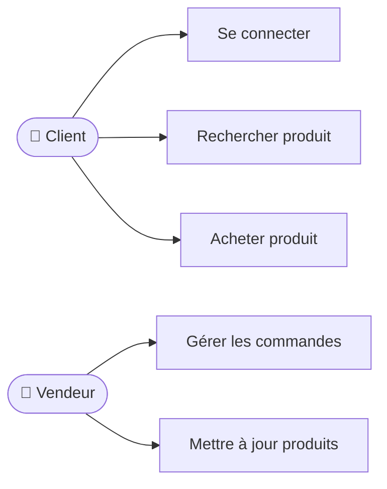
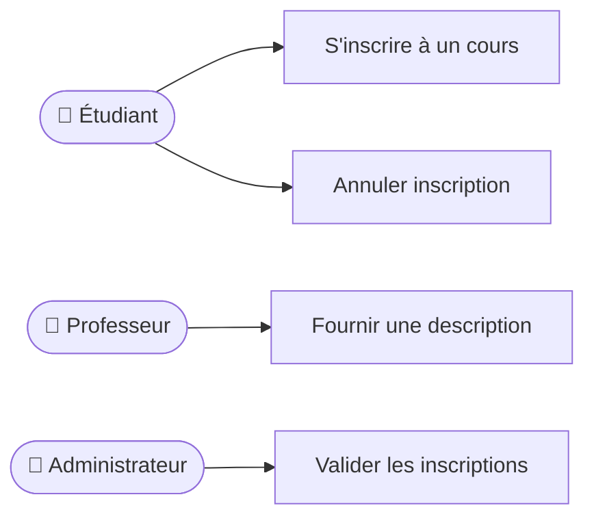
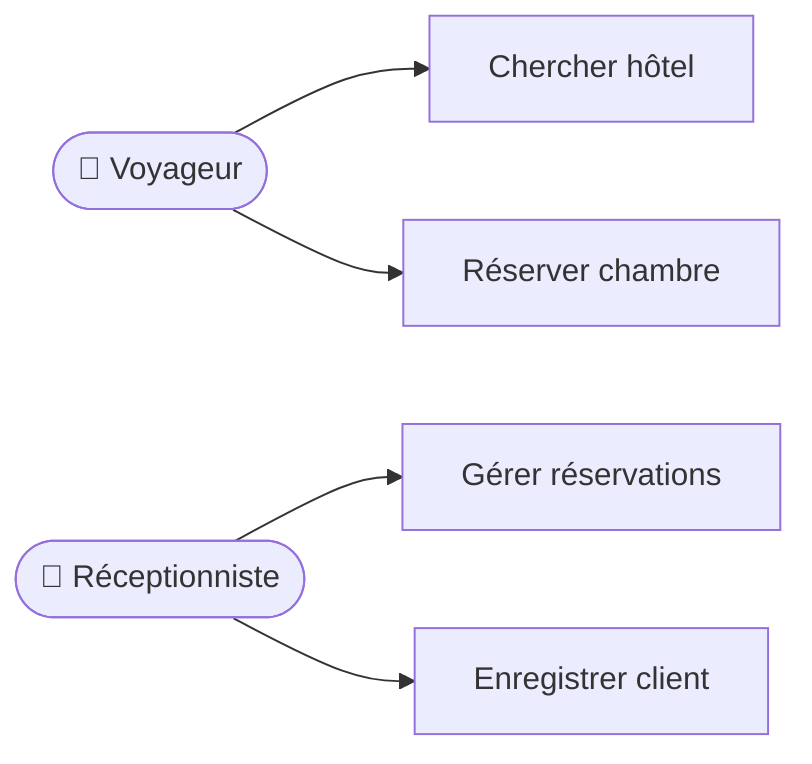

# Diagramme des cas d'utilisation

Le diagramme des cas d'utilisation est principalement utilisé en début de
projet lors de la phase d'analyse des besoins. Il permet de représenter les
fonctionnalités d'un système du point de vue des utilisateurs finaux, appelés
"acteurs". Ce diagramme s'adresse particulièrement aux analystes, développeurs,
ainsi qu'aux clients afin d'obtenir une vision claire et commune du système à
développer.

## Comment faire un diagramme des cas d'utilisation

    1. Identifier les acteurs (utilisateurs ou systèmes externes).
    2. Identifier les cas d'utilisation (fonctionnalités du système). Utiliser un verbe d'action pour les nommer.
    3. Associer les acteurs aux cas d'utilisation.

## Exemple de diagramme des cas d'utilisation

Voici quelques exemples concrets illustrés à l'aide de MermaidJS sous forme de
flowchart (car MermaidJS ne supporte pas directement les useCaseDiagrams) :

<Tabs>
<TabItem value="exemple_1" label="Exemple 1">
<Card >
  <CardHeader>
  **Application web de commerce électronique**
  </CardHeader>
  <CardBody>

   </CardBody>
</Card>
</TabItem>

<TabItem value="exemple_2" label="Exemple 2">
<Card >
  <CardHeader>
**Système de gestion d'inscription à un cours**
  </CardHeader>
  <CardBody>

   </CardBody>
</Card>
</TabItem>

<TabItem value="exemple_3" label="Exemple 3">
<Card >
  <CardHeader>
**Plateforme de réservation d'hôtel**
  </CardHeader>
  <CardBody>

    </CardBody>
</Card>
</TabItem>

</Tabs>