# Diagramme des cas d'utilisation

Le diagramme des cas d'utilisation est principalement utilisé en début de
projet lors de la phase d'analyse des besoins. Il permet de représenter les
fonctionnalités d'un système du point de vue des utilisateurs finaux, appelés
"acteurs". Ce diagramme s'adresse particulièrement aux analystes, développeurs,
ainsi qu'aux clients afin d'obtenir une vision claire et commune du système à
développer.

## Comment faire un diagramme des cas d'utilisation

    1. Identifier les acteurs (utilisateurs ou systèmes externes).
    2. Identifier les cas d'utilisation (fonctionnalités du système). Utiliser un verbe d'action pour les nommer.
    3. Associer les acteurs aux cas d'utilisation.

## Exemple de diagramme des cas d'utilisation

Voici quelques exemples concrets illustrés à l'aide de MermaidJS sous forme de
flowchart (car MermaidJS ne supporte pas directement les useCaseDiagrams) :

{/* TODO: Mettre les trois examples dans un carroussel */}

**Exemple 1 : Application web de commerce électronique**

```mermaid
flowchart LR
  Client([👤 Client]) --> Connexion[Se connecter]
  Client --> Recherche[Rechercher produit]
  Client --> Achat[Acheter produit]
  Vendeur([👤 Vendeur]) --> Gerer[Gérer les commandes]
  Vendeur --> MettreAJour[Mettre à jour produits]
```

**Exemple 2 : Système de gestion d'inscription à un cours**

```mermaid
flowchart LR
  Etudiant([👤 Étudiant]) --> Inscrire[S'inscrire à un cours]
  Etudiant --> Annuler[Annuler inscription]
  Professeur([👤 Professeur]) --> GererCours[Fournir une description]
  Administrateur([👤 Administrateur]) --> Valider[Valider les inscriptions]
```

**Exemple 3 : Plateforme de réservation d'hôtel**

```mermaid
flowchart LR
  Voyageur([👤 Voyageur]) --> ChercherHotel[Chercher hôtel]
  Voyageur --> ReserverChambre[Réserver chambre]
  Receptionniste([👤 Réceptionniste]) --> GererReservations[Gérer réservations]
  Receptionniste --> EnregistrerClient[Enregistrer client]
```

