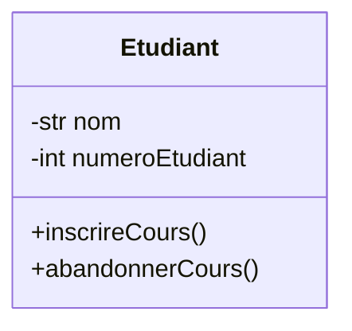
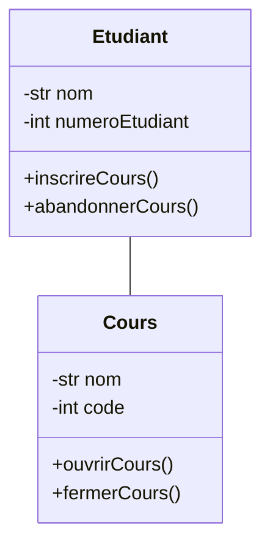
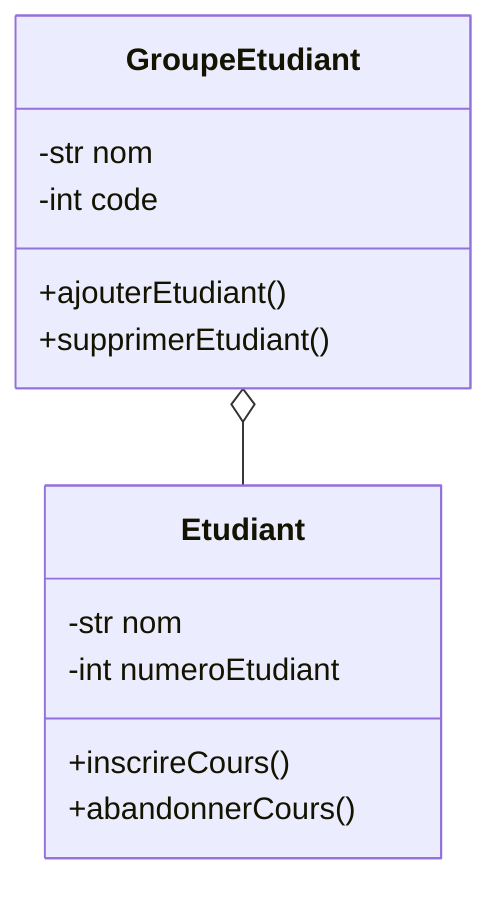
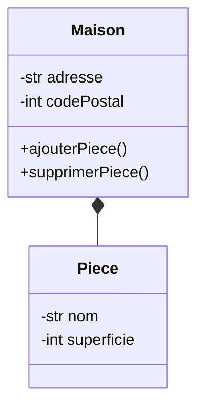
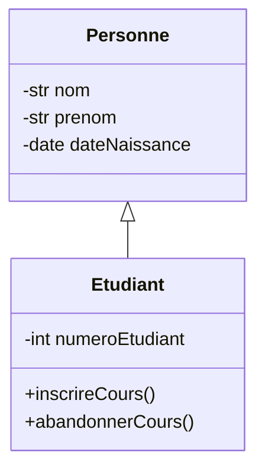

# Diagramme de classe

Le diagramme de classe est essentiel durant la phase de conception logicielle.
Il définie clairement les classes, leurs attributs, leurs méthodes et les
relations entre ces classes. Il est particulièrement utilisé pour modéliser la
structure orientée objet d'une application.

## Quand utiliser un diagramme de classe ?

- Lors de la conception détaillée d'un système pour identifier et définir les
  classes nécessaires.
- Pour documenter clairement l'organisation interne d'une application orientée
  objet.
- Lorsqu'on veut illustrer les relations entre les différents objets du
  système.

## À qui s'adresse-t-il ?

Le diagramme de classe s'adresse principalement aux développeurs, pour
comprendre la structure des données à implémenter, ainsi qu'aux architectes
logiciels, pour valider la cohérence de la conception.

## Étapes pour créer un diagramme de classe

1. Identifier les classes : Déterminer les entités principales à modéliser.

2. Définir les attributs : Établir les propriétés des classes qui représentent
les données pertinentes.

3. Définir les méthodes : Préciser les opérations que chaque classe peut exécuter.

4. Définir les relations entre classes : Identifier comment les classes
interagissent entre elles (associations, agrégations, compositions, héritage).

Ceci est un processus itératif qui peut être affiné au fur et à mesure de
l'avancement du projet.

## Représentation d'une classe

Une classe est représentée par un rectangle contenant trois compartiments :

- Le premier compartiment contient le nom de la classe.
- Le deuxième compartiment contient les attributs de la classe.
- Le troisième compartiment contient les méthodes de la classe.

Par exemple le diagramme suivant représente une classe `Etudiant` :

Dans cet exemple, la classe `Etudiant` possède deux attributs (`nom` et
`numeroEtudiant`) et deux méthodes (`inscrireCours` et `abandonnerCours`).

Le signe `-` devant un attribut ou une méthode signifie qu'il est privé, tandis
que le signe `+` signifie qu'il est public. Il existe aussi le signe `#` pour
les attributs et méthodes protégés, mais nous ne l'utilisons ce type d'attribut 
dans ce cours.

## Relations entre classes

### Association

L'association est une relation entre deux classes qui indique qu'elles sont
liées d'une certaine manière. Par exemple, une classe `Etudiant` peut être
associée à une classe `Cours` pour indiquer que chaque étudiant suit un ou
plusieurs cours.

L'association est simplement représentée par une ligne entre les deux classes. Elle ne détaille pas
la nature de la relation.

### Agrégation et composition

Il arrive souvent qu'une classe soit composée d'autres classes ou qu'elle
contienne des instances d'autres classes. Dans ce cas, on utilise les relations
d'agrégation et de composition. La différence entre les deux est que dans le
cas de la composition, les objets contenus ne peuvent exister sans l'objet
conteneur, tandis que dans le cas de l'agrégation, les objets contenus peuvent
exister indépendamment.

Par exemple, une classe `GroupeEtudiant` peut être composée de plusieurs
instances de la classe `Etudiant`. Il s'agit d'une relation d'agrégation car les
étudiants peuvent exister indépendamment du groupe.

**Exemple d'agrégation :**

Un exemple de composition serait une classe `Maison` composée de plusieurs
instances de la classe `Piece`. Dans ce cas, les pièces ne peuvent exister sans
la maison.

**Exemple de composition :**

:::note

Une relation d'aggréation est représentée par un losange creux, tandis qu'une
relation de composition est représentée par un losange plein. Le losange est 
du côté de la classe qui contient l'autre classe.

:::

### Héritage

L'héritage est une relation entre une classe parent et une classe enfant. Tel
que vu au [chapitre sur les classes](../classes), une classe enfant hérite des
attributs et méthodes de la classe parent. Les relations d'héritage sont
représentées par une flèche pointant vers la classe parent.

Par exemple, une classe `Etudiant` peut hériter de la classe `Personne` :

