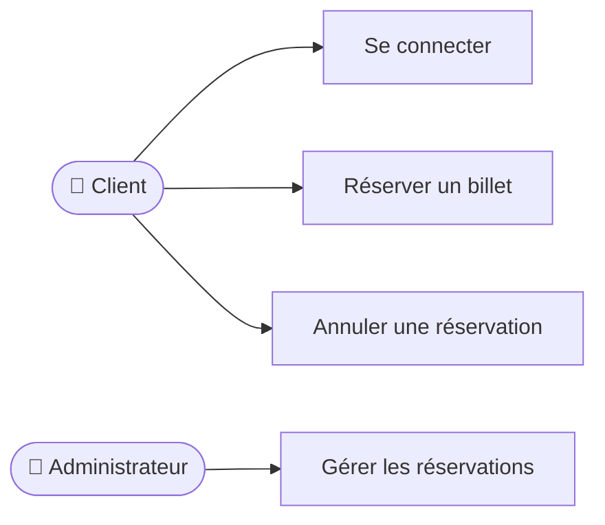
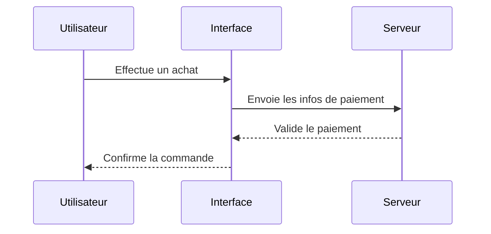
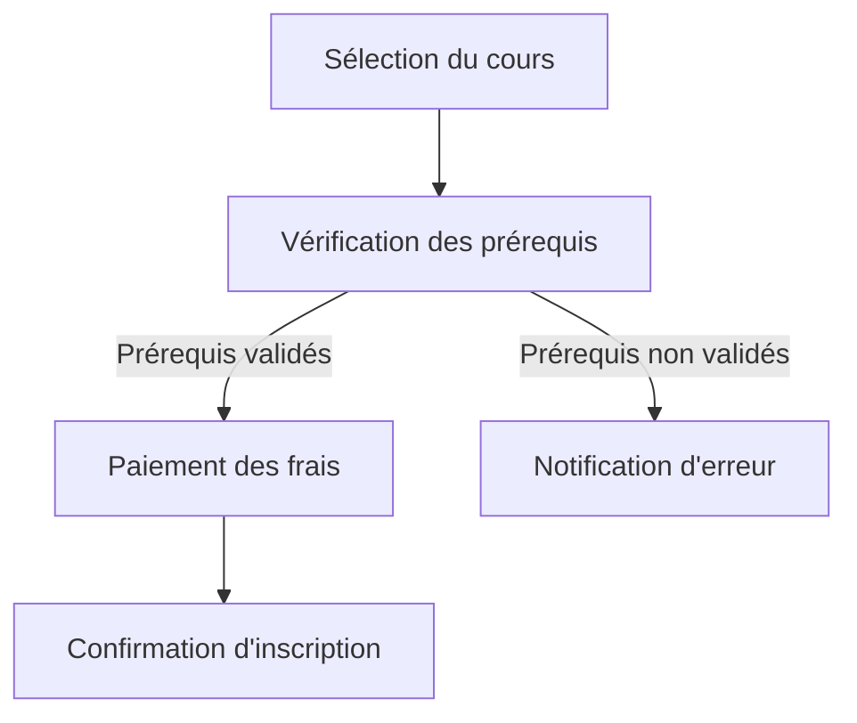
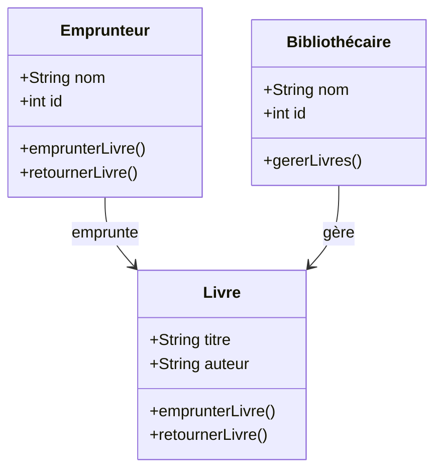

# Introduction à UML

UML, ou Unified Modeling Language, est un langage graphique standardisé utilisé
en informatique pour modéliser, visualiser, spécifier et documenter des
systèmes logiciels complexes. Il permet de communiquer efficacement les
différents aspects d'un logiciel entre les développeurs, les gestionnaires et
autres parties prenantes. Dans ce cours, nous explorerons les principaux
diagrammes UML suivants : les diagrammes des cas d'utilisation, de séquence,
d'activité et de classe.

## Diagramme des cas d'utilisation

Le diagramme des cas d'utilisation représente les interactions entre les
utilisateurs, nommés acteurs dans le jargon UML, et le système informatique, en
mettant l'accent sur les fonctionnalités attendues du système.

Son utilité est d'identifier clairement les besoins fonctionnels et les rôles des
différents acteurs. En voici un exemple simple :

## Diagramme de séquence

Le diagramme de séquence décrit la façon dont les objets interagissent entre
eux en termes de messages échangés au fil du temps.

Son utilité est de comprendre les interactions dynamiques entre différents
éléments du système dans des scénarios précis. Voici un exemple :

## Diagramme d'activité

Le diagramme d'activité représente graphiquement le déroulement logique d'une
activité ou d'un processus métier dans un système, semblable à un organigramme ou un diagramme de flux (flowchart).

Sont utilité est de modéliser les flux d'activités pour visualiser clairement le comportement du système.

## Diagramme de classe

Le diagramme de classe présente les structures statiques d'un système, montrant
les différentes classes, leurs attributs, méthodes et les relations entre ces
classes.

Son utilité est de modéliser clairement la structure des données et leur
organisation dans le système logiciel. Voici un exemple :

